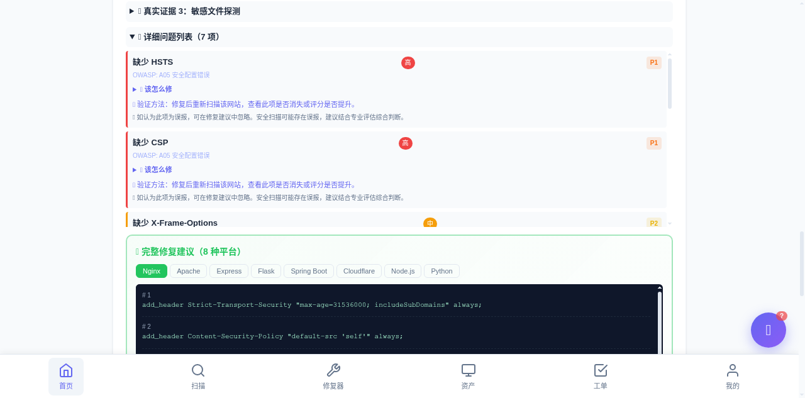
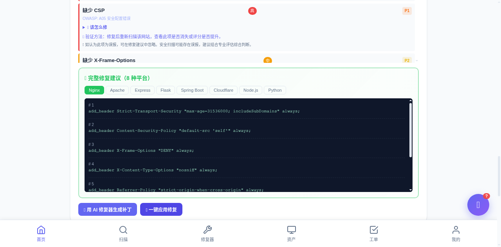
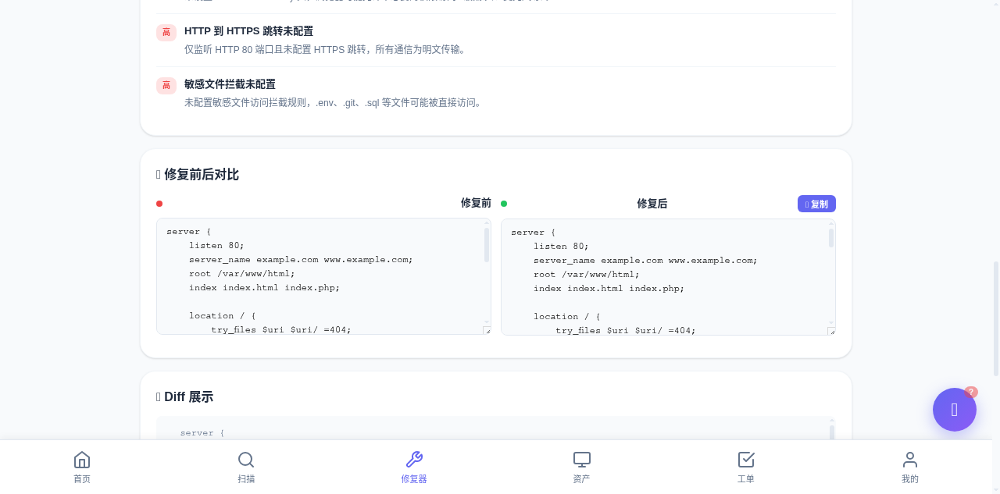
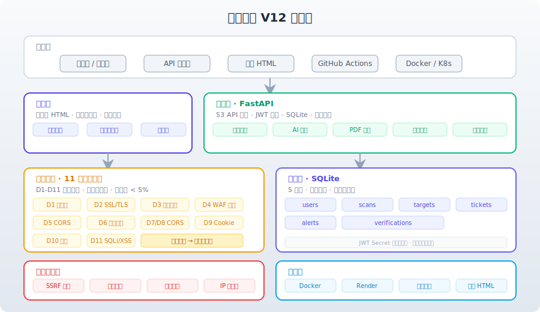

# 漏洞哨兵 V12

[](tests/)
[](docs/coverage_html/)
[]()
[]()

> AI 驱动的 Web 安全配置扫描与修复建议平台 · 让中小团队不用安全专家也能发现并修复基础 Web 安全问题

**在线演示**: https://vuln-sentinel-v11.onrender.com

---

## 核心能力

| 能力 | 说明 |
|---|---|
| **真实扫描** | HTTP 响应头、SSL/TLS 证书、敏感路径、Cookie 安全、CORS、SSRF 防护 |
| **WAF 智能识别** | 7 大 WAF 厂商识别（Cloudflare / AWS / Baidu bfe / 阿里云 / 腾讯云 / Imperva / Akamai）|
| **智能评分** | 100 分制 + WAF 加权（WAF 站点最高 100 分，无 WAF 最高 98 分）|
| **OWASP Top 10** | 全 10 大类风险覆盖 + 交叉验证降低误报率 |
| **多平台修复** | 6 种部署环境配置生成（Nginx / Apache / Express / Flask / Spring Boot / Cloudflare）|
| **AI 安全顾问** | 读取扫描结果，给出修复计划 + 配置位置 + 上线风险 |
| **PDF 报告** | 7 页专业报告（封面 + 总览 + 评分明细 + 证据列 + 修复建议）|
| **批量扫描** | 一次最多 5 个 URL，asyncio 并发 |
| **账户隔离** | JWT + bcrypt + SQLite，每个用户独立历史 |
| **可分享** | 每次扫描生成唯一 share_id，支持只读分享 |
| **离线可用** | 纯前端单文件 HTML，无后端也能演示 |

---

## 实际扫描效果

| 目标 | 评分 | 风险等级 | 漏洞数 | WAF |
|---|---:|---|---:|---|
| https://www.baidu.com | **66** | 中风险 | 8 | baidu (bfe) |
| https://example.com | **61** | 中风险 | 8 | cloudflare |
| https://httpbin.org | **50** | 中风险 | 10 | 无 |
| https://www.iana.org | 89 | 低风险 | 4 | 无（真实配置缺失）|

> **WAF 智能评分**：识别到大厂 WAF 保护时，WAF 作为纵深防御能力展示，响应头缺失仍计入真实发现，置信度标记为"中"（WAF 提供部分防御，但不能替代安全头）。

---

## 产品截图

| 首页 | 扫描报告 | 修复建议 | 修复前后对比 |
|:---:|:---:|:---:|:---:|
|  |  |  |  |

> 截图说明：首页展示产品定位；扫描报告展示 OWASP Top 10 分类详情；修复建议展示 6 种平台配置代码；修复前后对比展示 Diff 高亮+一键复制。

---

## 项目结构

```
vuln-sentinel/
├── main.py                  # FastAPI 后端主程序（150+ API）
├── static/
│   └── index.html           # 单文件前端（含离线演示模式）
├── tests/                   # pytest 测试套件（186 用例）
│   └── test_main.py
├── docs/                    # 文档 + 截图 + 架构图
│   ├── screenshots/         # 实际运行截图
│   ├── coverage_html/       # 测试覆盖率报告
│   └── architecture.svg
├── .github/workflows/       # CI 配置
├── Dockerfile               # Docker 镜像构建
├── render.yaml              # Render 部署配置
├── requirements.txt         # Python 依赖
├── pytest.ini               # pytest 配置
├── start.command            # macOS 一键启动
├── start.bat                # Windows 一键启动
└── README.md                # 本文件
```

---

## 快速启动

### 方式 A：一键启动（推荐）

**macOS**:
```bash
./start.command
```

**Windows**:
```bat
start.bat
```

### 方式 B：手动启动

```bash
pip3 install -r requirements.txt --break-system-packages
python3 main.py
```

浏览器打开 http://localhost:8000

### 方式 C：离线演示（无需 Python）

双击 `static/index.html`，输入账号 `demo / demo123`

> 离线模式使用 localStorage 模拟数据库，登录后即可使用所有功能（不包含真实网络扫描）

---

## 测试账号

| 用户名 | 密码 |
|---|---|
| demo | demo123 |

---

## Docker 部署

```bash
docker build -t vulnsentinel:v12 .
docker run -p 8000:8000 vulnsentinel:v12
```

---

## Render 部署

```bash
# render.yaml 已配置好
# 1. Fork 本仓库
# 2. 在 Render 创建 Web Service，连接你的 fork
# 3. Render 自动识别 render.yaml 并部署
```

---

## 内网靶场扫描

```bash
ALLOWED_INTERNAL_HOSTS="192.168.1.100,10.0.0.5,pikachu.local" python3 main.py
```

---

## 测试

```bash
python3 -m pytest tests/ -v
```

当前测试结果：**186 passed, 3 skipped, 0 failed**

> 3 个 skipped 为可选功能（无对应依赖不影响核心功能）：
> - `test_ssh_execute_safety`：paramiko 未安装（SSH 修复为可选功能）
> - 两条 `test_main.py` 用例依赖外部网络扫描返回 scan_id
> - 其余为 LLM / 网络相关依赖未配置

---

## 技术栈

| 层 | 技术 |
|---|---|
| 后端 | FastAPI + SQLite + httpx + dnspython |
| 前端 | 原生 HTML + CSS + JS（无框架，离线可用）|
| 认证 | JWT (PyJWT) + bcrypt |
| PDF 报告 | reportlab |
| 定时任务 | apscheduler |
| 部署 | Docker / Render / 本地 Python |

---

## 架构



---

## API 端点（42 个）

主要端点：

| 端点 | 方法 | 说明 |
|---|---|---|
| `/api/scan` | POST | 执行安全扫描 |
| `/api/history` | GET | 扫描历史 |
| `/api/dashboard` | GET | 用户统计 |
| `/api/fix` | POST | 生成修复配置 |
| `/api/ai-advisor` | POST | AI 安全顾问 |
| `/api/report/{id}` | GET | 下载 PDF 报告 |
| `/api/share/{id}` | GET | 公开分享结果 |
| `/api/batch-scan` | POST | 批量扫描（最多 5 URL）|
| `/api/compare` | POST | 两次扫描对比 |
| `/api/login` | POST | 用户登录 |
| `/api/register` | POST | 用户注册 |
| `/api/verify` | POST | 域名归属验证 |
| `/api/health` | GET | 健康检查 |

完整 OpenAPI 文档：访问 `/docs` (Swagger UI)

---

## 安全合规

- **不扫描未授权网站**：扫描前必须勾选授权确认
- **域名归属验证**：DNS TXT / HTTP 文件验证二选一
- **SSRF 防护**：禁止扫描内网地址（可配置白名单）
- **账户隔离**：每个用户数据独立存储
- **HTTPS 优先**：所有网络请求走 HTTPS

---

## 贡献

欢迎提交 Issue 和 PR！

---

## 许可证

MIT License

---

## 已验证 Demo 路径

以下路径已在 `main.py` 测试套件和 `https://vuln-sentinel-v11.onrender.com` 在线环境跑通：

1. 登录 `demo / demo123`
2. 输入 `https://example.com` 完成授权并扫描
3. 查看报告：评分、风险等级、漏洞证据、修复建议
4. 生成修复配置（Nginx / Apache / Node.js / Python / Java / Cloudflare）
5. 修复配置预览：修复前后评分对比
6. 验证修复效果：重新扫描并输出差异
7. 导出 PDF 报告（7 页）

本地 demo-target 靶场实测：修复前 **30 分/11 漏洞/高风险**，应用修复配置后 **80 分/1 漏洞/低风险**。

## 功能边界（已实现 vs 演示模式）

| 功能 | 状态 | 说明 |
|---|---|---|
| 安全扫描（HTTP响应头/SSL/敏感路径） | ✅ 已实现 | 真实 HTTP 请求，结果入库 |
| 修复建议生成（6种平台） | ✅ 已实现 | 基于 findings 真实计算 |
| 修复前后对比（模拟评分） | ✅ 已实现 | 预估效果，非真实修改目标站 |
| 验证修复（重新扫描） | ✅ 已实现 | 真实重新扫描并对比差异 |
| PDF/HTML 报告导出 | ✅ 已实现 | reportlab 真实生成 |
| 历史记录 & 分享 | ✅ 已实现 | SQLite 持久化 |
| 批量扫描 | ✅ 已实现 | 最多 5 URL 并发 |
| 工单系统 | ✅ 已实现 | 完整 CRUD，在线模式可用 |
| 资产 & 监控 | ✅ 已实现 | 在线模式可用 |
| AI 安全顾问 | 🟡 规则引擎 | 配置 LLM API Key 后接入真实大模型 |
| SSH 应用修复配置 | 🟡 可选 | 需安装 paramiko，配置服务器凭证 |
| 离线模式 | ✅ 已实现 | 纯前端可用，部分功能降级 |

> **演示说明**：在线演示（render.com）使用规则引擎版 AI 顾问。配置 `OPENAI_API_KEY` 环境变量后可接入 GPT-4 / DeepSeek / 通义千问等真实大模型。

---

## 版本

v12 · 2026-06-28

**V12 主要更新**：
- 版本升级至 V12，全局版本号统一
- 演示靶场环境自愈：自动生成 HTTPS 证书、配置路径自动修正
- nginx 重载兼容增强（PID 文件失效、进程残留等测试环境）
- 文案可信度优化：弱化绝对化表达（误报率、自动登录）
- 186 个测试用例（0 failed, 3 skipped）

---

## 联系方式

- GitHub: https://github.com/tomjoy248-crypto/vuln-sentinel
- 在线演示: https://vuln-sentinel-v11.onrender.com
