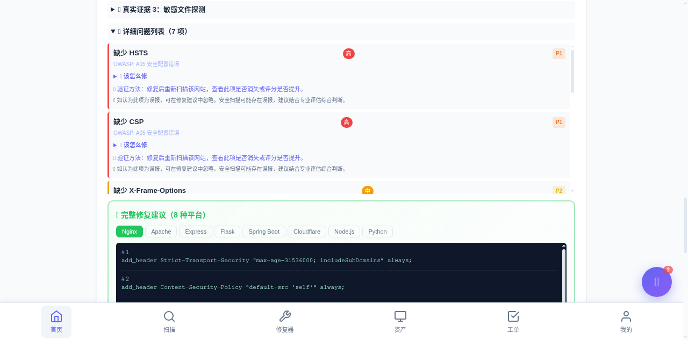
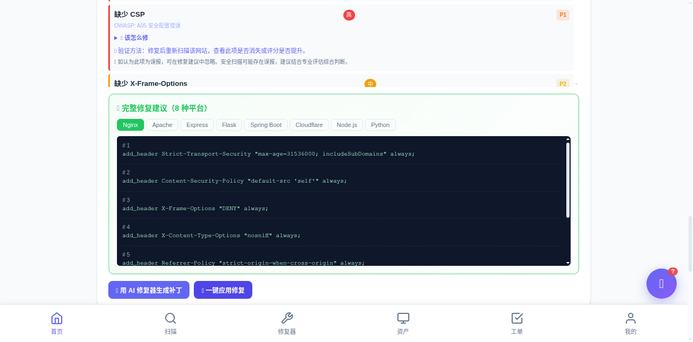
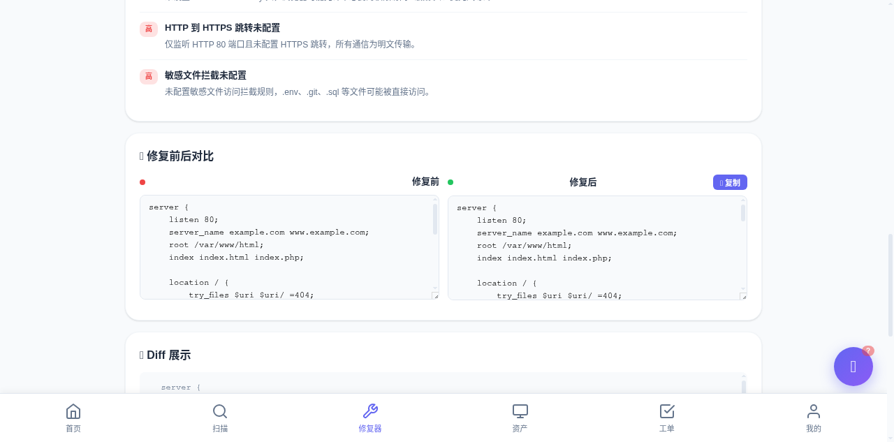

# 漏洞哨兵 11-S

[](tests/)
[](docs/coverage_html/)
[]()
[]()

> **让中小团队在 30 秒内知道自己网站的安全风险，并直接拿到能上线的修复配置。**

**在线体验**: https://vuln-sentinel-v11-s.onrender.com

---

## 我们解决什么问题

中小企业和独立开发者上线网站后，通常面临三个现实困境：

- **没有安全团队**：请不起专职安全工程师，安全测试长期处于空白。
- **工具门槛高**：OWASP ZAP、Nikto 等专业工具安装复杂、报告难读。
- **报告无法落地**：传统扫描工具只告诉你"有问题"，不会告诉你"怎么修"。

漏洞哨兵把完整的安全检测流程压缩成三步：**输入网址 → 查看风险 → 复制修复配置**。不需要安装软件，不需要安全背景，3 秒出结果。

---

## 谁适合使用

| 用户类型 | 典型场景 |
|---|---|
| **独立开发者 / 个人站长** | 产品上线前快速自检，避免基础安全配置疏漏 |
| **中小企业技术负责人** | 低成本满足等保 / 数据安全法的基础自查要求 |
| **乙方交付团队** | 给客户交付前做初筛，生成专业 PDF 报告 |
| **运维 / DevOps** | 批量监控多个站点安全状态，跟踪修复闭环 |

---

## 核心能力

| 能力 | 说明 |
|---|---|
| **OWASP Top 10 扫描** | 全 10 大类风险覆盖，15 个检测维度，多维交叉验证降低误报 |
| **智能评分** | 100 分制安全评分 + WAF 加权，风险等级一目了然 |
| **多平台修复配置** | 一键生成 Nginx / Apache / Express / Flask / Spring Boot / Cloudflare 配置 |
| **AI 安全顾问** | 基于扫描结果给出修复位置、上线风险、修复优先级 |
| **修复前后对比** | 重新扫描后自动对比差异，验证修复效果 |
| **PDF 报告** | 7 页专业报告，含封面、总览、评分明细、证据链、修复建议 |
| **工单管理** | 高危问题自动建单，跟踪修复状态 |
| **资产监控** | 添加站点资产后定时巡检，状态变化自动告警 |
| **免费试用** | 无需注册即可扫描白名单站点，体验完整报告 |

---

## 实际扫描效果

| 目标 | 评分 | 风险等级 | 漏洞数 | WAF |
|---|---:|---|---:|---|
| https://www.baidu.com | **66** | 中风险 | 8 | baidu (bfe) |
| https://example.com | **61** | 中风险 | 8 | cloudflare |
| https://httpbin.org | **50** | 中风险 | 10 | 无 |
| https://www.iana.org | **89** | 低风险 | 4 | 无 |

---

## 定价

| 版本 | 价格 | 包含内容 |
|---|---:|---|
| **免费版** | ￥0 / 月 | 每月 5 次扫描、查看报告、公开站点试用 |
| **专业版** | ￥99 / 月 | 无限扫描、修复配置生成、PDF 导出、AI 顾问 |
| **团队版** | ￥499 / 月 | 多成员、资产监控、工单系统、批量扫描、优先支持 |
| **企业版** | 按需求报价 | 私有化部署、自定义检测规则、SLA、专属客户成功 |

---

## 产品截图

| 工作台 | 扫描报告 | 修复建议 | 修复前后对比 |
|:---:|:---:|:---:|:---:|
|  |  |  |  |

---

## 快速启动

### 方式 A：一键启动（推荐）

**macOS**:
```bash
./start.command
```

**Windows**:
```bat
start.bat
```

### 方式 B：手动启动

```bash
pip3 install -r requirements.txt --break-system-packages
python3 main.py
```

浏览器打开 http://localhost:8000

### 方式 C：Docker 部署

```bash
docker build -t vulnsentinel:v11-s .
docker run -p 8000:8000 vulnsentinel:v11-s
```

### 方式 D：Render 部署

```bash
# render.yaml 已配置好
# 1. Fork 本仓库
# 2. 在 Render 创建 Web Service，连接你的 fork
# 3. Render 自动识别 render.yaml 并部署
```

---

## 使用流程

1. **注册账号** 或直接使用免费试用扫描白名单站点
2. 输入目标 URL（如 `https://example.com`），勾选授权确认
3. 查看扫描报告：评分、风险等级、漏洞证据、修复建议
4. 生成修复配置（Nginx / Apache / Node.js / Python / Java / Cloudflare）
5. 查看修复前后评分对比（预估效果）
6. 验证修复效果：重新扫描并输出差异
7. 导出 PDF 报告（7 页）

---

## 项目结构

```
vuln-sentinel/
├── main.py                  # FastAPI 后端主程序（150+ API）
├── src_scanner.py           # SRC 级扫描引擎（SQLI/XSS/信息泄露/CSRF/敏感路径/组件漏洞）
├── models.py                # Pydantic 数据模型
├── frontend/                # 前后端分离前端（Vite + 原生 JS）
│   ├── src/
│   │   ├── main.js          # 应用入口与全局事件
│   │   ├── api.js           # 后端 API 封装
│   │   ├── utils.js         # 工具函数
│   │   ├── style.css        # Burp Suite 暗色主题
│   │   ├── pages/           # 页面模块
│   │   │   ├── home.js
│   │   │   ├── scan.js
│   │   │   ├── result.js    # SRC 级报告渲染
│   │   │   ├── fixer.js
│   │   │   ├── tickets.js
│   │   │   ├── assets.js
│   │   │   ├── profile.js
│   │   │   └── evolution.js
│   │   └── components/      # 可复用组件
│   ├── index.html
│   ├── package.json
│   └── vite.config.js
├── static/                  # 构建后的前端产物（由 backend 直接服务）
│   ├── index.html
│   └── assets/
├── tests/                   # pytest 测试套件（186 用例）
│   └── test_main.py
├── docs/                    # 文档 + 截图 + 架构图
│   ├── screenshots/         # 实际运行截图
│   ├── coverage_html/       # 测试覆盖率报告
│   └── architecture.svg
├── .github/workflows/       # CI 配置
├── Dockerfile               # Docker 镜像构建
├── render.yaml              # Render 部署配置
├── requirements.txt         # Python 依赖
├── pytest.ini               # pytest 配置
├── start.command            # macOS 一键启动
├── start.bat                # Windows 一键启动
└── README.md                # 本文件
```

---

## 内网目标扫描

```bash
ALLOWED_INTERNAL_HOSTS="192.168.1.100,10.0.0.5,pikachu.local" python3 main.py
```

---

## 测试

```bash
python3 -m pytest tests/ -v
```

当前测试结果：**186 passed, 3 skipped, 0 failed**

> 3 个 skipped 为可选功能（无对应依赖不影响核心功能）：
> - `test_ssh_execute_safety`：paramiko 未安装（SSH 修复为可选功能）
> - 两条 `test_main.py` 用例依赖外部网络扫描返回 scan_id
> - 其余为 LLM / 网络相关依赖未配置

---

## 技术栈

| 层 | 技术 |
|---|---|
| 后端 | FastAPI + SQLite + httpx + dnspython |
| 前端 | Vite + 原生 JS + 模块化组件（前后端分离）|
| 扫描引擎 | SRC 级漏洞报告（SQLI / XSS / 信息泄露 / CSRF / 敏感路径 / 过时组件）|
| 认证 | JWT (PyJWT) + bcrypt |
| PDF 报告 | reportlab |
| 定时任务 | apscheduler |
| 部署 | Docker / Render / 本地 Python |

---

## 架构


---

## API 端点（42 个）

主要端点：

| 端点 | 方法 | 说明 |
|---|---|---|
| `/api/scan` | POST | 执行安全扫描 |
| `/api/history` | GET | 扫描历史 |
| `/api/dashboard` | GET | 用户统计 |
| `/api/fix` | POST | 生成修复配置 |
| `/api/ai-advisor` | POST | AI 安全顾问 |
| `/api/report/{id}` | GET | 下载 PDF 报告 |
| `/api/share/{id}` | GET | 公开分享结果 |
| `/api/batch-scan` | POST | 批量扫描（最多 5 URL）|
| `/api/compare` | POST | 两次扫描对比 |
| `/api/login` | POST | 用户登录 |
| `/api/register` | POST | 用户注册 |
| `/api/verify` | POST | 域名归属验证 |
| `/api/public-demo-scan` | POST | 免费试用扫描（白名单站点）|
| `/api/health` | GET | 健康检查 |

完整 OpenAPI 文档：访问 `/docs` (Swagger UI)

---

## 安全合规

- **不扫描未授权网站**：扫描前必须勾选授权确认
- **域名归属验证**：DNS TXT / HTTP 文件验证二选一
- **SSRF 防护**：禁止扫描内网地址（可配置白名单）
- **账户隔离**：每个用户数据独立存储
- **HTTPS 优先**：所有网络请求走 HTTPS

---

## 功能边界

| 功能 | 状态 | 说明 |
|---|---|---|
| 安全扫描（HTTP响应头/SSL/敏感路径） | 已实现 | 真实 HTTP 请求，结果入库 |
| 修复建议生成（6种平台） | 已实现 | 基于 findings 真实计算 |
| 修复前后对比（模拟评分） | 已实现 | 预估效果，非真实修改目标站 |
| 验证修复（重新扫描） | 已实现 | 真实重新扫描并对比差异 |
| PDF/HTML 报告导出 | 已实现 | reportlab 真实生成 |
| 历史记录 & 分享 | 已实现 | SQLite 持久化 |
| 批量扫描 | 已实现 | 最多 5 URL 并发 |
| 工单系统 | 已实现 | 完整 CRUD |
| 资产 & 监控 | 已实现 | 定时扫描 + 告警 |
| AI 安全顾问 | 规则引擎 | 配置 LLM API Key 后接入真实大模型 |
| SSH 应用修复配置 | 可选 | 需安装 paramiko，配置服务器凭证 |
| 免费试用扫描 | 已实现 | 白名单站点无需注册 |

> **使用说明**：在线环境（render.com）使用规则引擎版 AI 顾问。配置 `OPENAI_API_KEY` 环境变量后可接入 GPT-4 等真实大模型。

---

## 贡献

欢迎提交 Issue 和 PR！

---

## 许可证

MIT License

---

## 版本

11-S · 2026-07-27

**11-S 主要更新**：
- 版本升级至 11-S，全局版本号统一
- 产品化改造：移除演示专用代码，转型为商业产品
- 移除离线演示模式、硬编码演示账号、本地靶机
- 公开扫描端点重构为免费试用
- OWASP Top 10 全 10 大类覆盖 + 交叉验证降低误报率
- 前后端分离：Vite 模块化前端 + FastAPI 后端
- SRC 级漏洞报告：每条漏洞含请求/响应证据、Payload、复现步骤、修复代码、参考链接
- 186 个测试用例（0 failed, 3 skipped）

---

## 联系方式

- GitHub: https://github.com/tomjoy248-crypto/vuln-sentinel
- 在线环境: https://vuln-sentinel-v11-s.onrender.com
