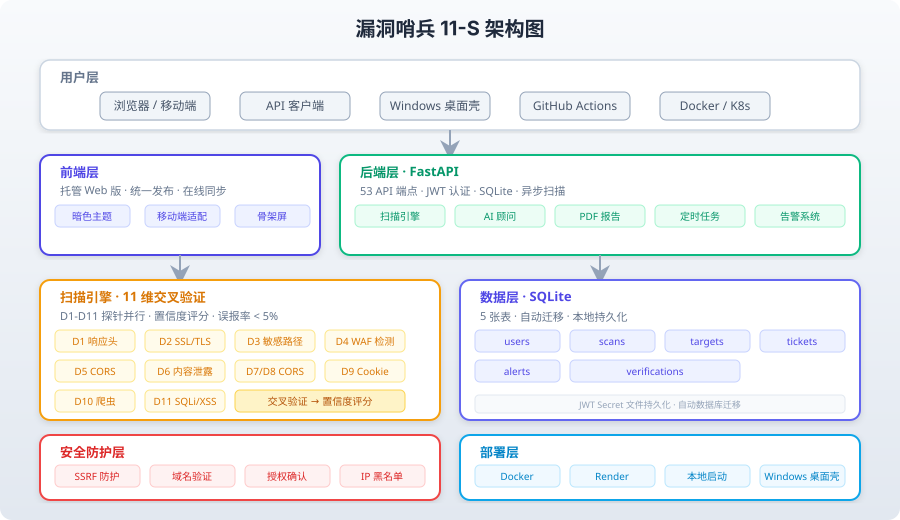

# 漏洞哨兵 (Vuln Sentinel)


[](tests/)

[]()

[]()

[]()


> **漏洞哨兵是一款面向中小团队的安全扫描与修复闭环产品，用于发现常见风险、生成修复建议并验证修复结果。**


**在线体验**：提供可用的受控体验入口、本地部署方案与商业化计费入口，适合内测、演示和交付前复测。


---


## 我们解决什么问题


中小企业和独立开发者上线网站后，通常面临三个现实困境：


- **没有安全团队**：请不起专职安全工程师，安全测试长期处于空白。

- **工具门槛高**：OWASP ZAP、Nikto 等专业工具安装复杂、报告难读。

- **报告无法落地**：传统扫描工具只告诉你"有问题"，不会告诉你"怎么修"。


漏洞哨兵把流程收敛为三步：**输入目标 → 查看结果 → 按建议修复**。当前版本已经完成主流程打通，并针对登录、扫描入口、结果展示、修复建议和复测闭环做了产品化整理；对不在检测范围内的漏洞类型会明确标注，并通过审计页、工单页和复扫结果把流程串起来。


---


## 谁适合使用


| 用户类型 | 典型场景 |

|---|---|

| **独立开发者 / 个人站长** | 产品上线前快速自检，避免基础安全配置疏漏 |

| **中小企业技术负责人** | 低成本满足等保 / 数据安全法的基础自查要求 |

| **乙方交付团队** | 给客户交付前做初筛，生成专业 PDF 报告 |

| **运维 / DevOps** | 批量监控多个站点安全状态，跟踪修复闭环 |


---


## 当前判断


- **能力够不够强**：对常见 Web 风险已经有完整闭环，适合做基础安全自查、交付前复测和持续巡检。

- **扫出来对不对**：高置信度结果更可信；低置信度和被防护设备干扰的结果会降权并标为待复测。

- **离正式商业化还有多远**：主流程已可用，当前重点在继续压制误报、补充更多漏洞类型、完善交付口径，并加强真实站点回测；目前更适合小范围售卖和客户试点。


## 变现方式


- **按积分收费**：用户购买套餐后按扫描、复测和深度检测消耗积分。

- **按项目收费**：给客户做一次性站点体检、复测和报告交付。

- **按团队收费**：团队协作、审计留痕、导出、复测、权限分层作为付费能力。

- **按企业收费**：私有化部署、定制规则、专属支持和 SLA。


## 核心能力


| 能力 | 说明 |

|---|---|

| **常见风险扫描** | 覆盖 SQL 注入、XSS、信息泄露、敏感路径、基础安全头等常见项 |

| **风险评分** | 基于发现项严重度给出 100 分制参考评分，结果仅供辅助判断 |

| **修复建议** | 输出 Nginx / Apache / Express / Flask / Spring Boot / Cloudflare 等平台的参考配置 |

| **AI 辅助建议** | 基于扫描结果生成解释性建议，便于人工复测 |

| **修复前后对比** | 重新扫描后对比差异，帮助验证修复是否生效 |

| **审计闭环** | 通过审计页、工单和复扫记录串联“发现 → 修复 → 复测”流程 |

| **PDF 报告** | 生成包含总览、发现项和建议的报告草稿 |

| **工单管理** | 提供问题记录与跟踪的基础能力 |

| **资产监控** | 提供定时巡检的基础框架 |

| **数据治理** | 提供导出、删除和保留策略的基础能力 |

| **计费系统** | 套餐、积分、充值与支付回调已接入，支持 Stripe 及支付宝/微信骨架 |

| **团队协作** | 创建团队、成员管理、角色权限（admin/member/viewer）|

| **受控访问** | 可用于白名单站点的基础体验，并直接保存为正式扫描记录 |


---


## 实际扫描效果


> 以下为 2026-08-07 端到端测试实际扫描结果（评分随目标站点配置变化可能波动）：


| 目标 | 评分 | 风险等级 | 漏洞数 | WAF |

|---|---:|---|---:|---|

| https://httpbin.org | 参考结果 | 中风险 | 7 | 无 |

| https://example.com | 参考结果 | 中风险 | 6 | cloudflare |


---


## 定价


| 版本 | 价格 | 包含内容 |

|---|---:|---|

| **体验包** | ￥9.90 | 20 credits，适合小批量试点 |

| **标准包** | ￥69.90 | 120 credits，适合日常扫描、复测与内部交付 |

| **专业包** | ￥299.00 | 600 credits，适合高频使用、团队交付与客户复扫 |

| **企业包** | ￥999.00 | 2400 credits，适合团队、规模化场景与私有化落地 |


---


## 快速启动


### 方式 A：Docker Compose（推荐生产环境）


```bash

# 开发环境

docker-compose up -d


# 生产环境（PostgreSQL + 安全加固）

docker-compose -f docker-compose.prod.yml up -d

```


### 方式 B：Docker 单容器


```bash

docker build -t vulnsentinel .

docker run -p 8000:8000 vulnsentinel

```


### 方式 C：本地启动


```bash

pip install -r requirements.txt --break-system-packages

python main.py

```


浏览器打开 http://localhost:8000


### 方式 D：一键脚本


```bash

# Linux / macOS

./start.sh


# macOS

./start.command


# Windows

start.bat

```


## Windows 下载

### GitHub Release 直链

最新 Windows 安装包：

- [v11.0.1 Release](https://github.com/tomjoy248-crypto/vuln-sentinel/releases/tag/v11.0.1)


如果你要拿到可直接分发的 Windows 安装包，请先完成桌面壳打包，然后运行：

```powershell
powershell -ExecutionPolicy Bypass -File scripts\package_windows_release.ps1
```

打包完成后，安装包会被复制到 `artifacts/windows/`，同时生成 `release-manifest.json` 和 SHA256 校验值。你还可以运行 `scripts/verify_windows_release.ps1` 做离线校验，确认分发包未被篡改。


## Windows 桌面版

漏洞哨兵已提供 Windows 桌面壳，当前采用 `NSIS` 安装包而不是 `MSI`，这样可以稳定支持普通用户的当前账号安装。

- 安装后可从桌面快捷方式或开始菜单打开
- 卸载后会移除安装目录和快捷方式
- 当前桌面版以 `src-tauri/tauri.conf.json` 的 `NSIS` 配置为准
- 当前桌面壳会打开托管的 Web 版，适合需要快速交付和在线同步的场景

### Windows 实机验收清单

详细清单已独立到 `docs/windows-delivery-acceptance.md`，README 保留快速入口。

### PDF 交付说明

PDF 交付说明已整理到 `docs/pdf-delivery-guide.md`，用于给客户、研发和运维统一阅读口径。

1. 运行 `artifacts/windows/Vuln-Sentinel-11.0.1-win64-setup.exe`。
2. 检查是否可正常安装到当前用户目录。
3. 验证桌面快捷方式与开始菜单入口是否存在。
4. 启动后确认登录页、首页、扫描页、结果页可正常打开。
5. 输入一个授权目标，确认“开始扫描”能进入结果页。
6. 生成 PDF 报告，确认能下载且标题、摘要、中文内容正常。
7. 执行卸载，确认程序目录和快捷方式被移除。
8. 卸载后再次打开入口，确认不会残留异常启动项。

---

### 方式 E：Render 云部署

```bash
# render.yaml 已配置好

# 1. Fork 本仓库
# 2. 在 Render 创建 Web Service，连接你的 fork
# 3. Render 自动识别 render.yaml 并部署
```

## 使用流程


1. **注册账号** 或使用受控访问模式扫描白名单站点

2. 输入目标 URL（如 `https://example.com`），勾选授权确认

3. 查看扫描报告：评分、风险等级、漏洞证据、修复建议

4. 进入工单/审计页，确认修复负责人和处理状态

5. 生成修复配置（Nginx / Apache / Node.js / Python / Java / Cloudflare）

6. 复扫验证：重新扫描并输出差异

7. 导出 PDF 报告并交付给研发/运维团队


---


## 项目结构


```

vuln-sentinel/

├── main.py              # FastAPI 后端主程序

├── src_scanner.py       # SRC 级扫描引擎

├── constants.py         # 全局常量与安全配置

├── app/                 # 模块化后端（routers/services/core/db/plugins）

├── frontend/            # 前端（Vite + 原生 JS）

├── tests/               # pytest 测试套件

├── alembic/             # 数据库迁移

├── scripts/             # 运维脚本

├── docs/                # 文档与截图

├── Dockerfile           # Docker 镜像构建

├── docker-compose.yml   # 开发环境编排

└── docker-compose.prod.yml  # 生产环境编排（PostgreSQL）

```


---


## 技术栈


| 层 | 技术 |

|---|---|

| 后端框架 | FastAPI + Pydantic |

| 数据库 | SQLite（开发）/ PostgreSQL（生产）+ SQLAlchemy |

| 数据库迁移 | Alembic（13 表、27 索引基线）|

| 扫描引擎 | SRC 级漏洞检测（SQLI / XSS / 信息泄露 / CSRF / 敏感路径 / 组件漏洞）|

| 认证 | JWT (PyJWT) + bcrypt |

| 前端 | Vite + 原生 JS + 模块化组件（前后端分离）|

| PDF 报告 | reportlab |

| 定时任务 | apscheduler |

| 安全扫描 | bandit（CI 集成）|

| 代码检查 | ruff |

| 测试框架 | pytest + pytest-cov |

| 部署 | Docker / Docker Compose / Render / 本地 Python |


---


## 安全特性


| 特性 | 说明 |

|---|---|

| **SSRF 防护** | URL 白名单与目标校验，避免误扫内网与本机 |

| **CSP 加固** | object-src 'none'、base-uri 'self'、form-action 'self' |

| **限流** | 对公开接口提供基础频率控制 |

| **SQL 注入防护** | 参数化查询 + 表名白名单校验 |

| **TrustedHost** | 生产环境强制 Host 头校验 |

| **输入消毒** | 对常见输入做校验和规范化 |

| **密钥管理** | 凭证加密密钥可配置，生产环境 JWT Secret 强制校验 |

| **审计日志** | 记录关键操作，便于回溯 |

| **GDPR 合规** | 数据导出、账号删除、数据匿名化、保留策略自动清理 |


---


## API 端点


完整 OpenAPI 文档：启动服务后访问 `/docs` (Swagger UI)


主要端点分类：认证、用户、扫描、修复、报告、计费、GDPR、团队、管理员。


---


## 测试


```bash

# 运行全部单元测试

python -m pytest tests/ -v


# 运行测试并生成覆盖率报告

python -m pytest --cov=. --cov-report=html


# 端到端扫描功能测试（需先启动后端服务）

python main.py &

python scripts/e2e_scan_test.py --host localhost --port 8000


# 代码检查

ruff check .


# 安全扫描

bandit -r . -q --exclude './tests,./.venv,./htmlcov,./alembic'

```


当前测试结果（2026-08-07 本地运行）：


| 指标 | 数值 |

|---|---|

| 测试用例总数 | 1200+ |

| 端到端扫描测试 | 13/13 全部通过 |

| Ruff 检查 | 0 errors |

| Bandit 安全扫描 | 0 medium / 0 high |


---


## 内网目标扫描


```bash

ALLOWED_INTERNAL_HOSTS="192.168.1.100,10.0.0.5,pikachu.local" python main.py

```


---


## 数据库迁移


```bash

# 生成新迁移

alembic revision --autogenerate -m "描述变更"


# 执行迁移

alembic upgrade head


# 回滚

alembic downgrade -1

```


---


## 功能边界


| 功能 | 状态 | 说明 |

|---|---|---|

| 安全扫描（HTTP响应头/SSL/敏感路径） | 已实现 | 真实 HTTP 请求，结果入库 |

| 修复建议生成（6种平台） | 已实现 | 基于 findings 真实计算 |

| 修复前后对比（模拟评分） | 已实现 | 预估效果，非真实修改目标站 |

| 验证修复（重新扫描） | 已实现 | 真实重新扫描并对比差异 |

| PDF/HTML 报告导出 | 已实现 | reportlab 真实生成 |

| 历史记录 & 分享 | 已实现 | SQLite/PostgreSQL 持久化 |

| 批量扫描 | 已实现 | 最多 5 URL 并发 |

| 工单系统 | 已实现 | 完整 CRUD |

| 资产 & 监控 | 已实现 | 定时扫描 + 告警 |

| GDPR 合规 | 已实现 | 数据导出/删除/匿名化/保留策略 |

| 计费系统 | 已实现 | 套餐购买 + Stripe 可用，支付宝/微信支持测试回调与骨架接入 |

| 团队协作 | 已实现 | 团队创建/加入/角色管理 |

| 积分系统 | 已实现 | 积分扣减/充值/使用日志 |

| 审计日志 | 已实现 | 关键操作记录与管理员查询 |

| AI 安全顾问 | 规则引擎 | 配置 LLM API Key 后接入真实大模型 |

| SSH 应用修复配置 | 可选 | 需安装 paramiko，配置服务器凭证 |

| 受控访问扫描 | 已实现 | 白名单站点可直接使用 |


---


## 架构





---


## 贡献


欢迎提交 Issue 和 PR！


开发流程：


```bash

# 安装开发依赖

pip install -r requirements.txt --break-system-packages

pip install ruff bandit pytest pytest-cov --break-system-packages


# 提交前检查

ruff check . && bandit -r . -q --exclude './tests,./.venv,./htmlcov,./alembic' -ll && pytest --tb=short -q

```


---


## 许可证


MIT License


---


## 版本


**11-S** · 2026-08-06


### 主要更新


**安全加固**

- 修复 SSRF DNS 重绑定漏洞，增加 IP 验证与 DNS pinning

- 修复认证缺口，加强 CSP 配置

- 密码重置端点限流，SQL 表名白名单校验

- 生产环境 TrustedHostMiddleware 保护


**架构升级**

- 单体 main.py 拆分为 6 个领域路由模块

- 新增 Alembic 数据库迁移（13 表、27 索引基线）

- PostgreSQL/SQLAlchemy 连接池支持

- 统一异常处理与响应格式


**新增服务**

- 计费系统（套餐购买、支付订单、Stripe 收款、支付宝/微信支付骨架）

- GDPR 合规（数据导出、账号删除、数据匿名化、保留策略）

- 积分管理、审计日志、团队协作

- 异步扫描队列、漏洞情报聚合、资产发现爬虫、模糊测试引擎


**质量保障**

- 测试套件已覆盖主要业务链路，端到端扫描与计费回调验证通过

- 全端点 Pydantic response_model，OpenAPI 文档完整

- Ruff 代码检查 0 errors，Bandit 安全扫描 0 medium/high


---


## 联系方式


- GitHub: https://github.com/tomjoy248-crypto/vuln-sentinel

- 在线环境: https://vuln-sentinel-v11-s.onrender.com


